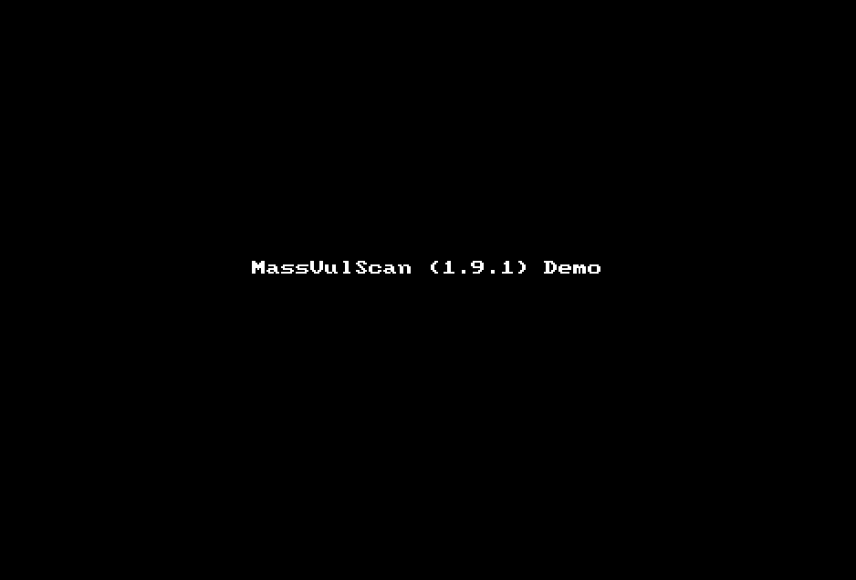
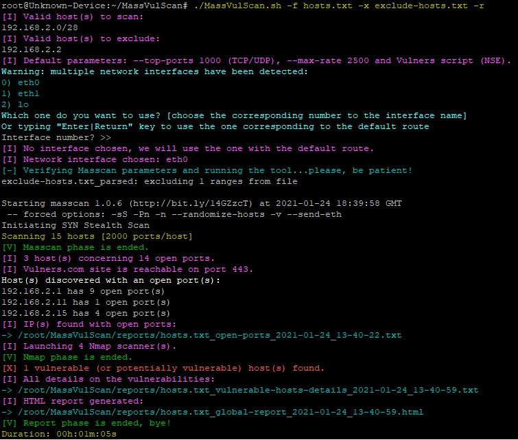
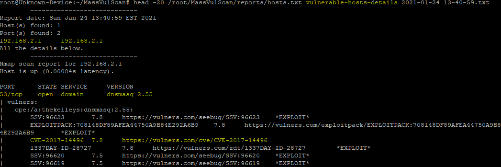

# MassVulScan :alien: [English version](https://github.com/choupit0/MassVulScan/blob/master/README.md)
[](https://github.com/choupit0/MassVulScan/releases)
[](https://github.com/choupit0/MassVulScan/blob/master/LICENSE)
[](https://github.com/choupit0/MassVulScan/graphs/commit-activity)
[](https://www.gnu.org/software/bash/)
# Description
Script Bash qui combine la puissance du scanner Masscan pour trouver des ports ouverts, l'efficacité du scanner Nmap pour identifier les services ouverts et leur version et enfin le script NSE vulners.nse pour identifier les vulnérabilités potentielles (CVE). Un rapport HTML sera généré contenant le résultat de l'analyse ainsi qu'un fichier TXT permettant de se focaliser sur les hosts vulnérables.


# Pré-requis
- Package xsltproc (pour la conversion d'un fichier XML vers HTML, pour le rapport final)
- Package ipcalc (pour valider les adresses IPs)
- Masscan, version >= 1.0.5 (https://github.com/robertdavidgraham/masscan)
- Nmap (https://nmap.org)
- Script NSE vulners.nse (https://github.com/vulnersCom/nmap-vulners)

**Je vous invite à lire le fichier "requirements.txt" si vous avez des difficultés. Il vous indiquera la marche à suivre pour installer chacun des pré-requis.**

Le script installera pour vous tous les pré-requis nécessaires au fonctionnement du script. Seuls les OS de la famille Debian sont concernés pour le moment.
Cette fonctionnalité a été validée sur les OS 64bits suivants (2 core CPU et 2GB RAM ~5 minutes) :
- Debian 10.0
- Elementary 5.0
- LinuxMint 19.1
- Ubuntu 19.04
- Parrot 5.5.17 (HackTheBox / HTB)
# Fonctionnement
Déroulement du script :
1) Identification express des hosts qui sont en ligne avec nmap (optionnel)
2) Pour chacun de ces hosts, identification extrêment rapide des ports TCP/UDP ouverts (masscan)
3) Le résultat est trié afin de rassembler tous les ports et protocoles à scanner par host (que l'on peut sauvegarder, optionnel)
4) Identificaton des services et vulnérabilités avec de multiples sessions en parallèle (nmap + vulners.nse), une session par host
5) Rapports Générés : rapport HTML contenant tous les détails pour chacun des hosts, vulérables ou non, et un fichier TXT permettant de se concentrer sur les hosts (potentiellement) vulnérables

Le rapport HTML utilise une feuille de style bootstrap (https://github.com/honze-net/nmap-bootstrap-xsl) pour plus de confort.
# Comment l'utiliser ?
Il suffit d'indiquer en paramètre (-f|--include-file) le fichier contenant une liste de réseaux, adresses IP et/ou noms d'hôtes à scanner :
```
git clone https://github.com/choupit0/MassVulScan.git
cd MassVulScan
chmod +x MassVulScan.sh
(root user or sudo) ./MassVulScan.sh -f [input file]
```
Liste des paramètres/arguments disponibles :

**Paramètre obligatoire:**
```
-f | --include-file = Fichier incluant les addresses IPv4 (format CIDR) et/ou noms d'hôtes à scanner (un(e) par ligne)
```
**Paramètres optionnels:**
```
-x | --exclude-file = Fichier incluant les addresses IPv4 (format CIDR) et/ou noms d'hôtes à NE PAS scanner (un(e) par ligne)
-i | --interactive = Paramètres supplémentaires : liste des ports à scanner, vitesse et script Nmap (NSE)
-a | --all-ports = Scanner les 65535 ports (TCP et UDP), à la vitesse de 2K pkts/sec et script Nmap vulners.nse 
-c | --check = Trouver les hosts en ligne (pré-scan) et ne scanner que ceux-là
-r | --report = Conserver toutes les adresses IPv4 ayant au moins un port ouvert avec leur protocole
-n | --no-nmap-scan = Détecter uniquement les ports ouverts de chacun des hosts (pas de rapport HTML)
```
Par défaut le script ne scannera que les 1000 premiers ports TCP/UDP parmi les ports les plus courants. Vous pouvez retrouver la liste ici : /usr/local/share/nmap/nmap-services. De même, le taux ou le nombre de paquets par seconde est fixé à 2500 par défaut.

Pour le format des fichiers, vous trouverez deux exemples dans le répertoire dédié :
```
root@ubuntu:~/audit/MassVulScan# cat example/hosts.txt
# Private subnet
192.168.2.0/24
webmail.acme.corp
root@ubuntu:~/audit/MassVulScan# cat example/exclude.txt
# Gateway
192.168.2.254
```
**A noter que le script détectera vous avez plusieurs interfaces réseaux. Ce qui est important pour Masscan qui prendra toujours par défaut l'interface qui possède la route par défaut. Il vous sera demandé d'en choisir une (pas de problème avec Nmap).**
# Démo

# Quelques captures d'écran







# Arborescence
```
root@Unknown-Device:~/MassVulScan# tree
.
├── CHANGELOG.md
├── demo
│   └── MassVulScan_Demo.gif
├── example
│   ├── exclude-hosts.txt
│   ├── hosts.txt
│   ├── hosts.txt_global-report_2021-01-24_13-51-40.html
│   ├── hosts.txt_open-ports_2021-01-24_13-50-51.txt
│   └── hosts.txt_vulnerable-hosts-details_2021-01-24_13-51-40.txt
├── LICENSE
├── MassVulScan.sh
├── README-FR.md
├── README.md
├── reports
├── requirements.txt
├── screenshots
│   ├── Ex-vulnerable-host-found.PNG
│   ├── Full-script.PNG
│   ├── HTML.PNG
│   ├── Masscan.PNG
│   ├── Menu_1-9-1.PNG
│   └── Nmap.PNG
├── sources
│   ├── installation.sh
│   ├── top-ports-tcp-1000.txt
│   └── top-ports-udp-1000.txt
└── stylesheet
    └── nmap-bootstrap.xsl

6 directories, 22 files
```
# Compatibilité
Le script a uniquement été testé sur des OS de la famille Debian mais devrait fonctionner sur la majorité des distributions Linux (hormis pour l'installation des pré-requis). Il peut détecter les ports ouverts sur les protocoles TCP et UDP.
# Remarques / Astuces
A noter que l'avantage d'utiliser le script NSE vulners.nse est qu'il interroge systématiquement la base de données du site de vulners.com, il s'agira donc des dernières données disponibles. De même, ce dernier effectue un classement et un trie des CVE identifiées, les plus sévères en haut de la liste, ce qui est bien pratique.

Le script est également compatible avec les catégories de Nmap (https://nmap.org/book/nse-usage.html#nse-categories) permettant de rechercher davantage de vulnérabilités (les plus connues comme ms17-010, EternalBlue) en plus des CVE identifiées depuis vulners.com. 

Enfin, avec le "mode interactif" (-i) vous avez la possibilité de préciser des arguments au script, par exemple : vulners --script-args mincvss=5
# Problème connus
Concernant SNMP, parfois, l'analyse du port UDP ne semble pas fonctionner correctement avec le programme masscan. J'essaie de trouver une solution.

# A faire
Mieux gérer les multiples adresses IP sur une seule interface réseau.

Améliorer la phase d'installtion des pré-requis pour n'installer que le strict nécessaire.

Améliorer l'analyse des fichiers en entrée afin d'éviter les scans en double, par exemple: 10.10.18.0/24 and 10.10.18.0/28
# Changelog
[Changelog](https://github.com/choupit0/MassVulScan/blob/master/CHANGELOG.md)
